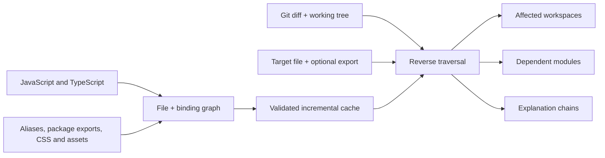

<h1 align="center">Monorepa Impact</h1>

<p align="center">
  <strong>Know exactly what a code change can affect—down to the function or type being imported.</strong>
</p>

<p align="center">
  A native dependency-analysis CLI for JavaScript and TypeScript repositories.<br>
  Find the workspaces that need CI, or trace everything that depends on one module or export.
</p>

<p align="center">
  <a href="./docs/cache.md#benchmark"></a>
  <a href="./LICENSE"></a>
</p>

<p align="center">
  <a href="#quick-start">Quick start</a> ·
  <a href="#two-questions-one-graph">How it works</a> ·
  <a href="#workspace-setup">Configuration</a> ·
  <a href="#documentation">Documentation</a>
</p>

Monorepa Impact answers the two dependency questions that usually make monorepo
automation slow or unreliable:

1. **What projects can this Git change reach?**
2. **What files depend on this module—or on one specific export from it?**

It reads the relationships already present in the repository instead of asking you to
maintain a second graph by hand. The result is precise enough to distinguish files,
imports, types, aliases, and re-exports, while staying conservative when JavaScript is
too dynamic to prove an exact answer.

Monorepa Impact selects work; it does not schedule it. Feed the result into pnpm,
npm, Yarn, CI, or any other automation you already use.

## Quick start

Install the prebuilt native CLI:

```bash
npm install --save-dev @monorepa/impact
```

Ask which workspaces are affected by your branch:

```bash
npx monorepa affected --base origin/main
```

Example output:

```text
@acme/storefront
@acme/ui
```

That list is the complete set of discovered workspaces reachable from the Git diff and
current working tree. With pnpm, you can immediately run a command only there:

```bash
npx monorepa affected --base origin/main -- 'pnpm {workspaces} --if-present test'
```

`{workspaces}` becomes sorted `--filter=<workspace>` arguments. When nothing is
affected, the child command is not started.

Monorepa reads `pnpm-workspace.yaml` by default. npm, Yarn, and custom layouts need one
small [configuration file](#workspace-setup).

## At a glance

| Question | Command | Result |
| --- | --- | --- |
| What should CI run? | `monorepa affected --base origin/main` | Affected workspace names |
| Why is a project affected? | Add `--explain` | The shortest dependency chain |
| What imports this module? | `monorepa dependents <file>` | Direct and transitive dependent files |
| Who uses this export? | Add `--specifier <name>` | Only consumers of that binding |
| How do I automate it? | Add `--json` | Sorted, stable, camel-cased JSON |

## Why path rules and package graphs are not enough

A changed file and an affected project are not the same thing. Shared code can cross
workspace boundaries through aliases, package exports, and re-export chains that a
directory rule cannot see.

| Approach | What it knows | Where it becomes costly or imprecise |
| --- | --- | --- |
| Run everything | Every task is covered | CI time grows with the whole repository |
| Changed-path rules | Where a file lives | Cross-project consumers require manual rules |
| Package graph | Which package depends on another package | It cannot tell which file or export is actually used |
| Monorepa Impact | Files, bindings, re-exports, aliases, and workspace exports | Dynamic or unresolved edges deliberately widen the result |

The safety rule is simple: when exactness cannot be proven, Monorepa prefers an extra
result over silently missing a real consumer.

## Two questions, one graph

The same native graph powers affected-project selection and reverse-dependency search.
Task names such as `test`, `typecheck`, and `build` never change its topology.



Under the hood:

1. **Parse once.** Oxc extracts dependencies and per-export fingerprints from the same
   JavaScript or TypeScript syntax tree.
2. **Resolve real targets.** Relative files, TypeScript aliases, project references,
   and exact, conditional, or wildcard package exports lead to indexed source files.
3. **Keep the imported name.** Named, default, aliased, type-only, namespace, and star
   relationships remain distinguishable through re-export chains.
4. **Walk backwards.** A Git change or target module is traced to its actual consumers.
5. **Reuse safely.** The cache validates the working tree and incrementally refreshes
   changed, staged, untracked, deleted, or renamed files.

### Why binding awareness matters

Imagine a shared module exports both `formatPrice` and `parseCurrency`, while the
storefront imports only `formatPrice`. If a diff can be isolated to `parseCurrency`,
the storefront is not selected. If `formatPrice` is re-exported under another name,
Monorepa preserves that mapping through the chain.

That is the difference between “this package depends on that package” and “this change
can actually reach this project.”

## Find affected workspaces

Affected mode compares the base ref with `HEAD` and includes current working-tree
changes:

```bash
npx monorepa affected --base origin/main
npx monorepa affected --base origin/main --explain
npx monorepa affected --base origin/main --json
```

Use `--explain` when a human needs the reason and `--json` when another tool needs the
result. Affected mode requires the comparison ref to exist locally, so CI checkouts
must include the base branch history.

## Find module dependents

Trace every direct and transitive importer of a file:

```bash
npx monorepa dependents packages/ui/src/button.tsx
```

Restrict the traversal to the `Button` export and show the chain:

```bash
npx monorepa dependents packages/ui/src/button.tsx --specifier Button --explain
```

Return only immediate importers:

```bash
npx monorepa dependents packages/ui/src/button.tsx --direct
```

Pass several target files as positional arguments; `--specifier` is repeatable. Use
`default` for a default export or `*` when every binding should match.

## What the graph understands

- static imports and re-exports;
- literal `import()` and `require()` calls;
- `import.meta.glob()` and assets referenced through `new URL()`;
- CSS, SCSS, and Less dependencies;
- TypeScript aliases, `extends`, and project references;
- exact, conditional, and wildcard `package.json#exports` entries;
- named, default, aliased, type-only, namespace, side-effect, and star relationships.

Non-literal runtime lookup, generated modules, and framework-specific string
entrypoints cannot always be recovered from syntax. Monorepa propagates a wildcard
when needed, and repository-wide effects can be modeled with `rootInputs`. See
[Architecture and precision](./docs/architecture.md) for the exact rules.

## Fast after the first graph

The first query builds a snapshot. Later queries validate and reuse it; an ordinary
source edit reparses only the changed files. Reverse queries load only the required
cache shards instead of deserializing the full graph.

The included release benchmark launches 60 fresh CLI processes per warm-query mode and
enforces a **5 ms p95 ceiling** for both trusted and automatically validated reverse
queries on its deterministic fixture. This is a regression budget, not a universal
latency promise for every machine or repository. See [Cache behavior](./docs/cache.md)
for the benchmark and cache contract.

Most users need no cache flags. The exceptional controls are:

| Flag | Use it when |
| --- | --- |
| `--strict-cache` | You need a complete rebuild from the working tree |
| `--rebuild-cache` | You want to replace the stored generation |
| `--no-cache` | The query must neither read nor write persistent cache data |
| `--trust-cache` | An external cache key already guarantees freshness |

## Workspace setup

With pnpm, the default `pnpm-workspace.yaml` is enough. Each matched directory with a
named `package.json` becomes a project.

For npm, Yarn, or a custom layout, create `affected.config.json`:

```json
{
  "base": "origin/main",
  "workspacePatterns": ["apps/*", "packages/*", "tooling/*"]
}
```

JSONC is supported. You can also pass `--config <path>` or use `workspaceFile` to read
patterns from another manifest. The [configuration reference](./docs/configuration.md)
covers root inputs, package export conditions, file selection, fallbacks, and cache
settings.

## Use it from Codex

This repository includes an installable skill that turns dependency questions into
the right Monorepa query and explains the shortest useful chain.

Ask Codex to install it once:

```text
Install the monorepa-find-dependencies skill from https://github.com/sergcen/impact/tree/main/skills/monorepa-find-dependencies
```

Then ask in plain language:

```text
Use $monorepa-find-dependencies to find everything that depends on
packages/ui/src/button.tsx and explain the chain for each project.
```

The skill supports direct, transitive, binding-specific, and Git-affected queries. Its
installable source is in [`skills/monorepa-find-dependencies`](./skills/monorepa-find-dependencies).

## Compatibility

| Area | Supported scope |
| --- | --- |
| Projects | JavaScript and TypeScript repositories; affected selection is workspace-oriented, while dependents queries also work in a single-package repository |
| Workspaces | pnpm by default; npm, Yarn, Lerna, and custom layouts through configuration or the Codex skill wrapper |
| Platforms | macOS, Linux, and Windows on ARM64 and x64 |
| Linux | glibc 2.35+ and musl builds |
| Installation | Node.js 22+ selects the prebuilt package; npm lifecycle scripts and optional dependencies must remain enabled |
| Runtime | The installed CLI executes the Rust binary directly; Node.js is not used as a runtime launcher |
| Git | Affected mode needs Git and the comparison history; dependents mode starts from target files |

Rust is required only when building from source.

## Designed for automation

- Results are sorted and deterministic.
- Public JSON fields are camel-cased and additive changes are preferred.
- A successful query with no matches exits with `0`.
- Invalid arguments, graph or cache failures, and child-command failures return a
  non-zero exit code.
- Version `1.0.0` treats the CLI, configuration, and public JSON interface as stable
  under Semantic Versioning.

See the [CLI and JSON reference](./docs/cli.md) for every flag and output field.

## Documentation

| Guide | Use it for |
| --- | --- |
| [Architecture and precision](./docs/architecture.md) | Dependency coverage, resolution order, binding propagation, and conservative fallbacks |
| [Configuration reference](./docs/configuration.md) | Workspace discovery, root inputs, exports, file selection, and cache options |
| [Cache behavior](./docs/cache.md) | Validation, incremental refresh, storage, controls, and the performance contract |
| [CLI and JSON reference](./docs/cli.md) | Commands, flags, output fields, explanations, and exit codes |
| [Contributing](./CONTRIBUTING.md) | Development workflow and pull request expectations |

## Build and contribute

Building from source requires Rust 1.89 or newer:

```bash
cargo build --release
./target/release/monorepa --help
```

Before changing graph semantics, resolution, cache formats, or JSON output, read
[AGENTS.md](./AGENTS.md). Security issues should be reported privately according to
[SECURITY.md](./SECURITY.md).

## License

[MIT](./LICENSE) © Monorepa contributors
